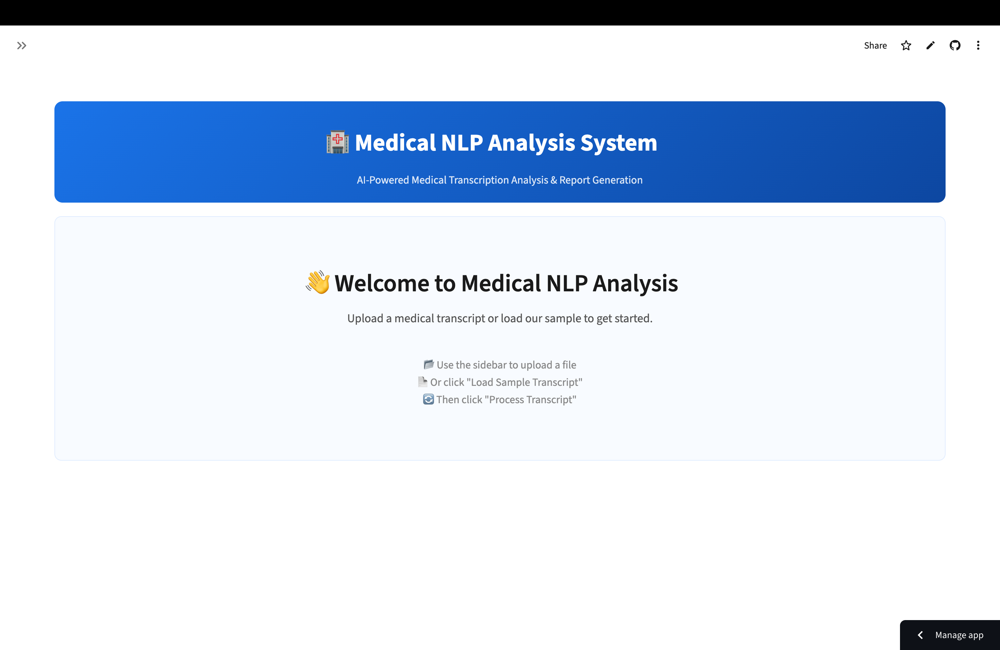
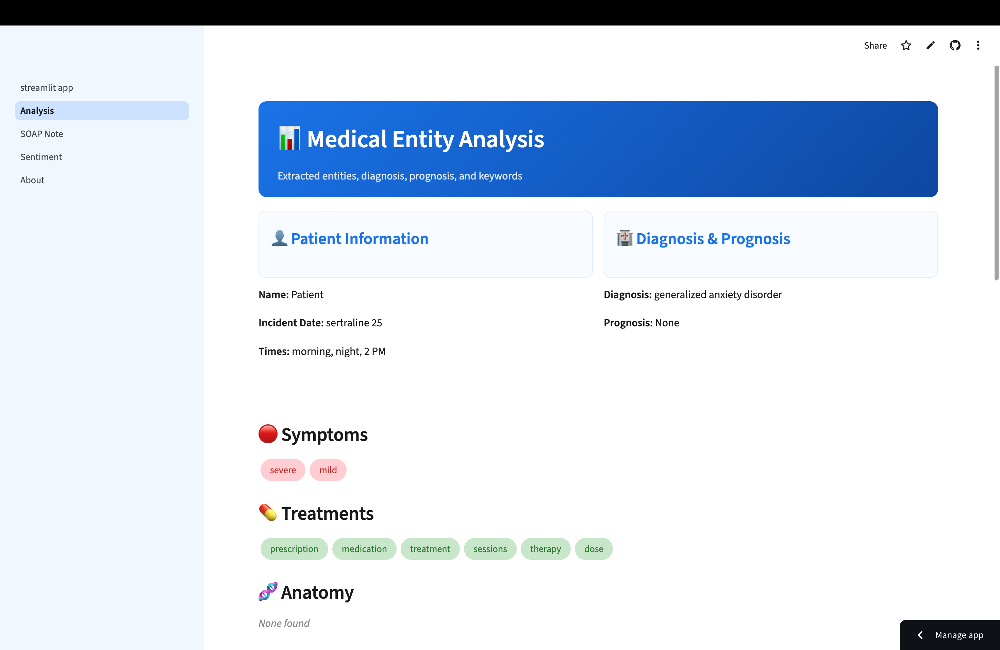
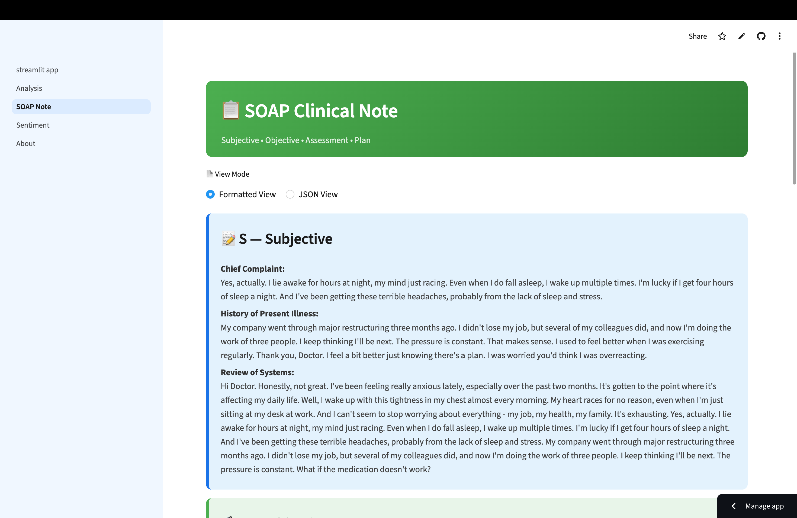
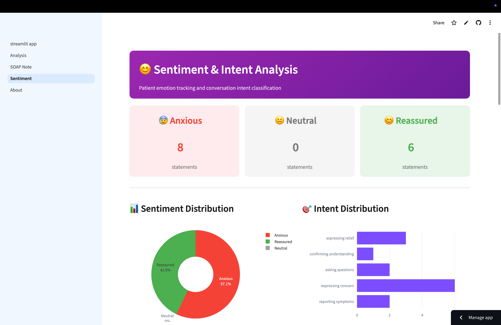

# 🏥 Medical NLP Analysis System 

**AI-Powered Medical Transcription Analysis & Clinical Report Generation**

[](https://medical-nlp-system-zrkqy2ub3ymnsnjdaseuwb.streamlit.app)
[](https://github.com/koushik-s012/medical-nlp-system)

> Automatically extract medical entities, analyze patient sentiment, classify conversation intent, and generate clinical SOAP notes from doctor-patient transcripts using state-of-the-art NLP.

---

## 🎯 What It Does ?

Transform messy medical transcripts into structured clinical insights in seconds:

**Input:** Raw doctor-patient conversation  
**Output:** Structured entities, sentiment analysis, SOAP notes, and actionable insights

---

## 📸 Screenshots

<div align="center">
  
  
  
  
</div>

---

## ✨ Key Features

| Feature | Technology | Description |
|---------|-----------|-------------|
| 🔍 **Medical NER** | scispaCy | Extract symptoms, treatments, diagnoses, anatomy |
| 😊 **Sentiment Analysis** | DistilBERT | Track patient emotions (Anxious/Neutral/Reassured) |
| 🎯 **Intent Classification** | BART Zero-Shot | Classify conversation intent (7 categories) |
| 📋 **SOAP Generation** | Rule-based + NER | Auto-generate clinical documentation |
| ⏰ **Temporal Extraction** | Regex patterns | Extract dates, times, treatment durations |
| 📊 **Interactive UI** | Streamlit + Plotly | Visualizations & multi-format exports |

---

## 🚀 Quick Start

### Try It Live
**[➡️ Launch Web App](https://medical-nlp-system-zrkqy2ub3ymnsnjdaseuwb.streamlit.app)**

### Run Locally
```bash
# Clone repository
git clone https://github.com/koushik-s012/medical-nlp-system.git
cd medical-nlp-system

# Install dependencies
pip install -r requirements.txt
python -m spacy download en_core_web_sm

# Run application
streamlit run app/streamlit_app.py
```

---

## 💡 Example Usage

### Input Transcript
```
Physician: How are you feeling?
Patient: I have severe neck pain since the car accident last week.
Physician: I see. Based on examination, this appears to be whiplash.
Patient: Will I recover?
Physician: Yes, with physiotherapy you should recover fully in 6 months.
```

### Output
```json
{
  "entities": {
    "symptoms": ["neck pain", "severe pain"],
    "diagnoses": ["whiplash"],
    "treatments": ["physiotherapy"],
    "temporal": ["last week", "6 months"]
  },
  "sentiment": {
    "dominant": "Anxious",
    "distribution": {"Anxious": 2, "Neutral": 1, "Reassured": 1}
  },
  "soap_note": {
    "subjective": "Patient reports severe neck pain since car accident...",
    "objective": "Physical examination conducted...",
    "assessment": "Diagnosis: whiplash injury",
    "plan": "Treatment: physiotherapy for 6 months. Prognosis: full recovery expected."
  }
}
```

---

## Tech Stack

**NLP Core:** spaCy • scispaCy • Transformers • KeyBERT  
**Models:** en_core_sci_md • DistilBERT • BART  
**Frontend:** Streamlit • Plotly  
**Backend:** Python 3.10+

[📚 Detailed Architecture](ARCHITECTURE.md) | [📖 Full Documentation](DOCUMENTATION.md)

---

## 📁 Project Structure
```
medical-nlp-system/
├── app/                    # Streamlit web interface
├── src/
│   ├── config/            # Configuration & constants
│   ├── preprocessing/     # Text cleaning, diarization
│   ├── models/           # NER, sentiment, intent, summarization
│   ├── generators/       # SOAP note generation
│   └── pipeline/         # Main integration pipeline
├── tests/                # Unit tests
└── data/                 # Sample transcripts
```

---

## 🧪 Testing
```bash
# Run all tests
pytest tests/ -v

# Run specific module
pytest tests/test_ner.py -v
```

**Test Coverage:** NER • Pipeline • Sentiment • Intent  
**Sample transcripts:** Whiplash injury • Anxiety disorder • Pediatric asthma

---

## 👤 Author

**Koushik**  
Built for medical NLP applications | February 2026

📧 [GitHub](https://github.com/koushik-s012) • 💼 [Live Demo](https://medical-nlp-system-zrkqy2ub3ymnsnjdaseuwb.streamlit.app)

---

## 📄 License

Available for educational and demonstration purposes.

---

<div align="center">
  <strong>⭐ Star this repository if you found it helpful!</strong>
</div>